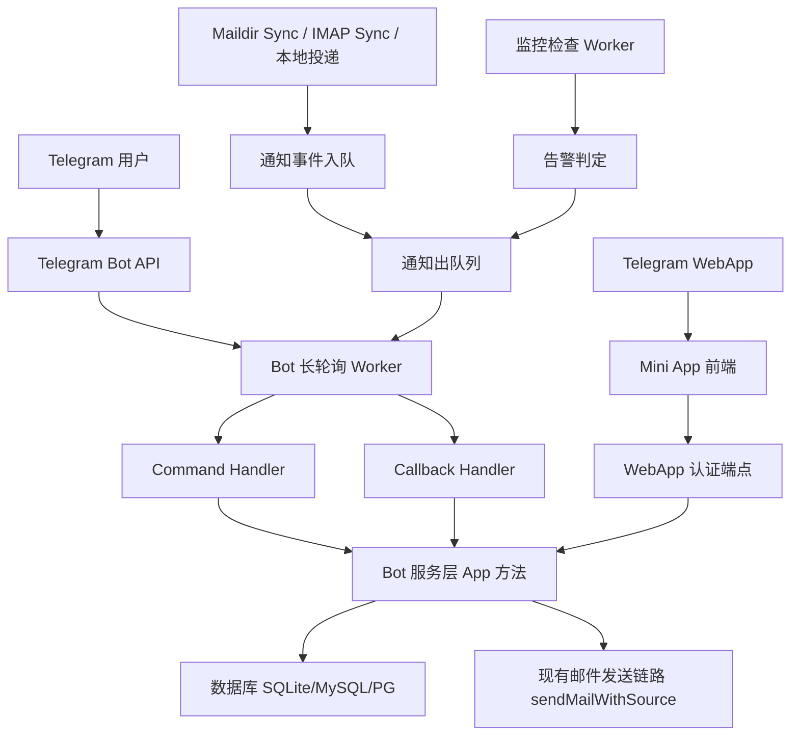

# Telegram Bot 技术设计

Feature Name: telegram-bot
Updated: 2026-08-12

## 描述

为 EOOS Email 增加 Telegram Bot 组件，提供新邮件通知、交互式收发邮件、管理员操作、服务告警监控和 Telegram Mini App 入口。Bot 作为 API 进程内的后台 worker 运行，使用标准库实现 Telegram `getUpdates` 长轮询，不引入第三方 Telegram 库。新邮件通知按邮箱级别开关控制；Mini App 为独立精简入口，复用现有前端组件。

## 架构



架构要点：

- Bot 长轮询 Worker 与通知出队列、告警判定均运行在 API 进程内，通过 `workerCancel`/`workerWG` 统一生命周期管理。
- 新邮件事件在邮件落库路径的收件箱分支入队，不直接调用 Telegram API，保证落库路径与推送解耦。
- Bot 内部所有数据操作复用现有 `App` 方法，不新增独立数据访问层。
- Mini App 通过独立的 WebApp 认证端点建立会话，复用现有 RBAC 权限。

## 组件与接口

### 1. 配置

新增 `Config` 字段（`apps/api/internal/app/config.go`）：

| 字段 | 环境变量 | 默认值 | 说明 |
|---|---|---|---|
| TelegramBotEnabled | `EOOS_TELEGRAM_BOT_TOKEN` | `""` | 为空则不启动 Bot |
| TelegramBotToken | `EOOS_TELEGRAM_BOT_TOKEN` | `""` | Bot token，只存内存 |
| TelegramBotTimeoutSeconds | `EOOS_TELEGRAM_BOT_TIMEOUT_SECONDS` | `60` | 长轮询超时 |
| TelegramAdminChatIDs | `EOOS_TELEGRAM_ADMIN_CHAT_IDS` | `""` | 告警接收聊天 ID，逗号分隔 |
| TelegramNotifyEnabled | `EOOS_TELEGRAM_NOTIFY_ENABLED` | `true` | 全局通知总开关（system_settings 可覆盖） |
| TelegramAlertQueueThreshold | `EOOS_TELEGRAM_ALERT_QUEUE_THRESHOLD` | `200` | 发送队列积压告警阈值 |

`BotToken` 通过 `os.Getenv` 读取，不写入日志、不写入数据库、不出现在 API 响应。

### 2. 数据库表

SQLite 迁移（`app.go` 的 `migrate` 内新增）与外部 schema（`schema_postgres.go`/`schema_mysql.go`）同步新增：

```sql
-- Telegram 绑定表
CREATE TABLE IF NOT EXISTS telegram_bindings (
  chat_id INTEGER PRIMARY KEY,          -- Telegram chat id，全局唯一
  user_id TEXT NOT NULL,                -- FK users.id
  is_admin_target INTEGER NOT NULL DEFAULT 0, -- 是否作为告警接收方
  created_at TEXT NOT NULL,
  updated_at TEXT NOT NULL,
  UNIQUE(user_id)
);

-- 绑定码
CREATE TABLE IF NOT EXISTS telegram_binding_codes (
  code TEXT PRIMARY KEY,
  user_id TEXT NOT NULL,
  chat_id INTEGER NOT NULL,
  expires_at TEXT NOT NULL,
  used_at TEXT DEFAULT ''
);

-- 新邮件通知出队列
CREATE TABLE IF NOT EXISTS telegram_notify_outbox (
  id TEXT PRIMARY KEY,
  mailbox_id TEXT NOT NULL,
  user_id TEXT NOT NULL,
  message_id TEXT NOT NULL,
  chat_id INTEGER NOT NULL,
  subject TEXT NOT NULL,
  from_addr TEXT NOT NULL,
  from_name TEXT NOT NULL DEFAULT '',
  snippet TEXT NOT NULL DEFAULT '',
  dedupe_key TEXT NOT NULL,
  attempt_count INTEGER NOT NULL DEFAULT 0,
  max_attempts INTEGER NOT NULL DEFAULT 5,
  next_attempt_at TEXT NOT NULL,
  delivered_at TEXT DEFAULT '',
  created_at TEXT NOT NULL,
  UNIQUE(dedupe_key)
);

-- 邮箱通知开关
CREATE TABLE IF NOT EXISTS telegram_mailbox_settings (
  mailbox_id TEXT PRIMARY KEY,
  notify_enabled INTEGER NOT NULL DEFAULT 1,
  notify_spam INTEGER NOT NULL DEFAULT 0,
  updated_at TEXT NOT NULL
);

-- 告警出队列（事件去重）
CREATE TABLE IF NOT EXISTS telegram_alert_outbox (
  id TEXT PRIMARY KEY,
  alert_type TEXT NOT NULL,
  chat_id INTEGER NOT NULL,
  title TEXT NOT NULL,
  body TEXT NOT NULL DEFAULT '',
  dedupe_key TEXT NOT NULL,
  attempt_count INTEGER NOT NULL DEFAULT 0,
  max_attempts INTEGER NOT NULL DEFAULT 5,
  next_attempt_at TEXT NOT NULL,
  delivered_at TEXT DEFAULT '',
  created_at TEXT NOT NULL,
  UNIQUE(dedupe_key)
);
```

### 3. Bot 核心

新增文件 `apps/api/internal/app/telegram_bot.go`、`telegram_commands.go`、`telegram_notify.go`、`telegram_alerts.go`。

#### Bot 生命周期

```go
type telegramBot struct {
    app *App
    token string
    offset int64
    stop chan struct{}
    wg   sync.WaitGroup
}
```

- `App.New()` 中若 `cfg.TelegramBotToken != ""`，启动 `telegramBotWorker`。
- 使用标准库 `net/http` 调用 Telegram Bot API：
  - `GET /bot{token}/getUpdates?offset=&timeout=` 长轮询
  - `POST /bot{token}/sendMessage`、`sendPhoto`（可选）、`answerCallbackQuery`、`editMessageText` 等
- 每次更新处理后更新 `offset = updateID + 1`，失败不推进 offset。
- 长轮询间隔、超时用 `EOOS_TELEGRAM_BOT_TIMEOUT_SECONDS` 控制。

#### 命令路由

`telegramCommands` 表：命令名 → 处理函数签名 `func(a *App, update, state) error`。命令组：

| 命令 | 角色 | 行为 |
|---|---|---|
| `/start` | 全部 | 返回功能简介与绑定引导 |
| `/bind` | 全部 | 生成绑定码，提示在 Web 设置页输入 |
| `/unbind` | 已绑定 | 解除当前聊天绑定 |
| `/status` | 已绑定 | 返回当前绑定邮箱与通知开关状态 |
| `/inbox` | 已绑定 | 返回默认收件箱最近 N 条邮件列表（inline keyboard） |
| `/read <id>` | 已绑定 | 返回邮件详情（发件人/主题/时间/摘要/附件） |
| `/send` | 已绑定 | 引导式发信：收件人→主题→正文 |
| `/reply <id>` | 已绑定 | 引导式回复 |
| `/open` | 已绑定 | 返回 Mini App 打开按钮 |
| `/admin users` | admin | 用户列表 |
| `/admin domains` | admin | 域名列表 |
| `/admin mailboxes` | admin | 邮箱列表 |
| `/admin disable <email>` | admin | 禁用用户 |
| `/admin enable <email>` | admin | 启用用户 |

所有管理命令先校验 `chatID` 对应绑定用户角色为 admin，否则返回无权限提示。

#### 发信流程

`/send` 与 `/reply` 采用会话状态机：Bot 进程内存中维护 `chatID → composeState{step, mailboxID, to, subject}`，超时（如 10 分钟）未完成则清空。最终提交调用现有 `sendMailWithSource`（`mail_handlers.go`），复用全部校验、附件限制、限流与 Sent 副本逻辑。

### 4. 新邮件通知

#### 事件入队点

在邮件落库路径的收件箱分支入队：

- `syncMaildirFile`（`maildir_sync.go:536`）Inbox 分支，已知 mailbox/folder/message。
- `insertExternalIMAPMessageOnce`（`external_imap.go:1236`）后。
- `sendMailWithSource`（`mail_handlers.go:844-890`）本地收件副本。

统一封装 `enqueueTelegramNotify(ctx, mailboxID, userID, messageID, meta)`：

1. 查 `telegram_mailbox_settings.notify_enabled`，关闭则跳过。
2. 查垃圾邮件文件夹，若为 Spam 且 `notify_spam=0` 则跳过。
3. 查 `telegram_bindings` 得 chatID，无绑定则跳过。
4. 构建 `dedupe_key = mailboxID + ":" + messageID`，`INSERT OR IGNORE` 到 `telegram_notify_outbox`。

#### 通知出队列 Worker

`telegramNotifyWorker`：每 5 秒取到期未投递的通知，调用 Telegram `sendMessage` 或 `sendPhoto`（若可带摘要图），成功标记 `delivered_at`，失败按 `attempt_count` 指数退避（30s/2m/10m/1h/6h），超过 `max_attempts` 丢弃。发送前再次校验绑定关系存在且通知开关仍开启。

通知消息结构：`[发件人] 主题` + 摘要 + 时间 + inline keyboard `打开邮件`（`url` 指向 Mini App 邮件详情 URL）。

### 5. 服务告警

`telegramAlertWorker` 周期性检查：

| 告警 | 判定条件 | 去重键 |
|---|---|---|
| `queue_failed` | 发送队列出现最终失败记录 | `queue_failed:{date}` |
| `queue_backlog` | 未完成队列数 > 阈值 | `queue_backlog:{date}:{level}` |
| `worker_heartbeat` | 关键 worker 心跳超时 | `worker_heartbeat:{worker}` |
| `smtp_connect` | SMTP 连接失败次数窗口内超阈值 | `smtp_connect:{hour}` |
| `db_error` | 数据库连接失败 | `db_error:{hour}` |

告警写入 `telegram_alert_outbox`（去重键防重复），由出队列 Worker 推送至 `EOOS_TELEGRAM_ADMIN_CHAT_IDS` 中已绑定为 `is_admin_target` 的聊天。

### 6. 邮箱通知开关管理

新增管理/用户设置端点：

- `GET /api/me/telegram/settings` → 返回绑定状态 + 各邮箱通知开关。
- `PUT /api/me/telegram/settings/{mailboxId}` → 更新某邮箱 `notify_enabled`/`notify_spam`。
- `GET /api/me/telegram/binding-code` → 生成绑定码（10 分钟有效），由 Web 设置页展示。

前端 `lib/api.ts` 增加对应方法，设置页（`profile.tsx` 或独立 Telegram 设置区）展示绑定码与邮箱开关。

### 7. Mini App

#### 后端认证端点

- `POST /api/telegram/webapp-auth`：
  1. 接收 Telegram WebApp `initData`。
  2. 按 Telegram 规范校验：`hash` 字段 = HMAC-SHA256(secret, data_check_string)，`secret = HMAC-SHA256(bot_token, "WebAppData")`。
  3. 校验 `auth_date` 在 24 小时内。
  4. 校验 `user.id` 已绑定（`telegram_bindings`），取出 user。
  5. 签发与 Web 登录相同的 session cookie（`issueSession`）。
  6. 返回用户信息 + 重定向目标。

#### 前端

- 新增独立入口页 `/telegram`（懒加载），读取 `window.Telegram.WebApp.initData`，调用 `webapp-auth` 完成静默登录后跳转主界面或邮件详情。
- 通知按钮 URL 格式：`{PublicBaseURL}/telegram?mail={messageId}`。
- 复用现有 `ProtectedLayout`、邮件列表/详情组件，仅做入口与主题适配。

### 8. 安全

- Bot token 仅存在于进程内存与部署环境变量。
- WebApp `initData` 的 HMAC 校验必须使用 bot token 派生 secret，拒绝无法验证的会话。
- 绑定码：随机 8 字符，10 分钟有效，单次使用，登录态下生成。
- 管理命令：每次执行前校验绑定聊天对应账号 admin 角色。
- Telegram 消息正文中的邮件内容先转义 Markdown 特殊字符。
- 通知只发送摘要与元数据，不发送完整邮件原文。
- 出队列发送前重新校验绑定与开关状态，防幽灵推送。

## 数据模型

- `telegram_bindings`：聊天与用户一对一。
- `telegram_binding_codes`：一次性绑定码。
- `telegram_notify_outbox`：新邮件通知队列，`dedupe_key` 唯一。
- `telegram_mailbox_settings`：邮箱通知开关。
- `telegram_alert_outbox`：告警队列，`dedupe_key` 唯一。

## 正确性属性

- 每条新邮件通知通过 `dedupe_key(mailboxID, messageID)` 保证至多入队一次。
- 推送前校验绑定与开关，解除绑定后未投递通知被丢弃。
- 长轮询 offset 仅在成功处理更新后推进，失败不丢更新。
- Bot 组件仅在有 token 时启动，邮件服务不依赖 Bot 可用性。
- 告警按去重键避免风暴。

## 错误处理

| 场景 | 处理 |
|---|---|
| Telegram API 超时/网络错误 | 记录日志，通知/告警入队重试，退避后丢弃 |
| `getUpdates` 401（token 失效） | 记录错误并停止长轮询 worker，写日志告警 |
| WebApp initData 校验失败 | 401 + 前端提示用浏览器登录 |
| 绑定码过期/已用 | 拒绝并提示重新生成 |
| 发信输入非法 | 会话状态机返回对应提示并停留当前步骤 |
| 绑定账号已解绑后收到命令 | 提示重新绑定，不执行命令 |

## 测试策略

- **单元测试**：命令路由解析、`initData` HMAC 校验、dedupe 键生成、退避计算、Markdown 转义。
- **集成测试**：`enqueueTelegramNotify` 入队逻辑（含 spam/开关/绑定过滤）、管理命令权限校验、`send` 状态机提交调用现有发信链路（用内存 HTTP 服务 mock Telegram API）。
- **手动验证**：
  - `/start`、`/bind` 绑定码在 Web 设置页输入后完成绑定。
  - 两个测试账号互发邮件，验证 Inbox 通知、Spam 不通知、开关关闭不通知。
  - `/inbox`、`/read`、`/send`、`/reply` 全流程。
  - 管理员命令对非管理员返回无权限。
  - Mini App 打开通知 URL 自动登录并定位到邮件详情。

## 参考

[^1]: (Telegram Bot API) - [getUpdates 长轮询与 sendMessage](https://core.telegram.org/bots/api)
[^2]: (WebApp initData 校验) - [Telegram Web App Validation](https://core.telegram.org/bots/webapps#validating-data-received-via-the-mini-app)
[^3]: (apps/api/internal/app/mail_handlers.go) - `insertMessageWithDB`、`sendMailWithSource`
[^4]: (apps/api/internal/app/status_webhook.go) - 出队列 worker 模板
[^5]: (apps/api/internal/app/app.go) - `startWorker`、`Close`、迁移
[^6]: (apps/api/internal/app/config.go) - `LoadConfig`
